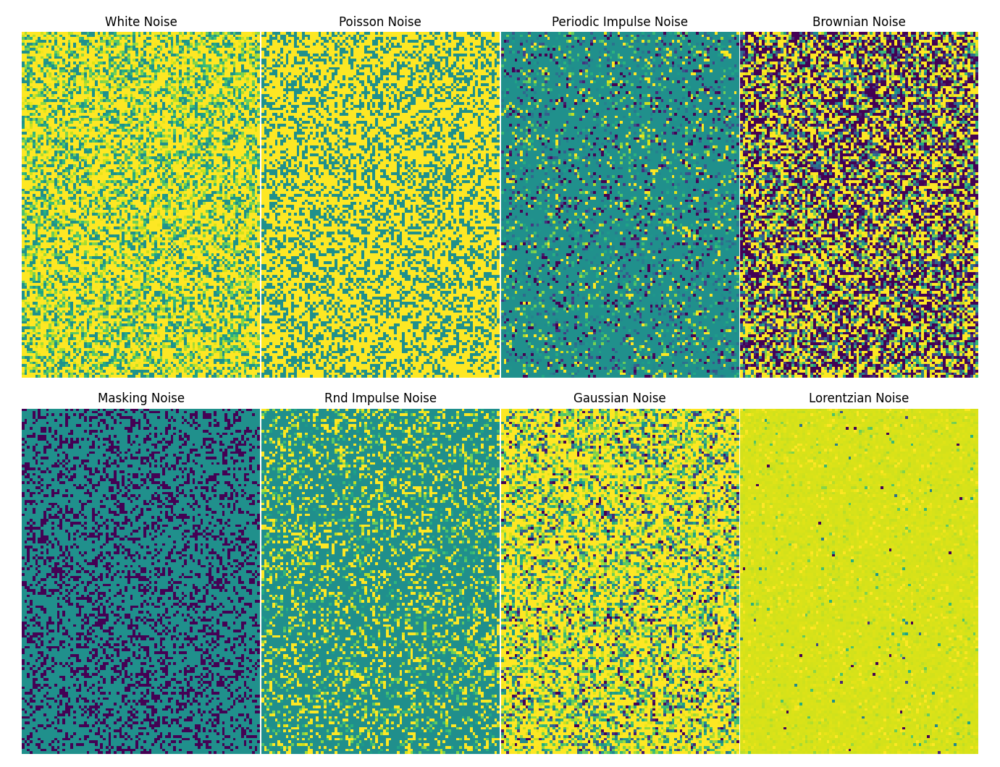
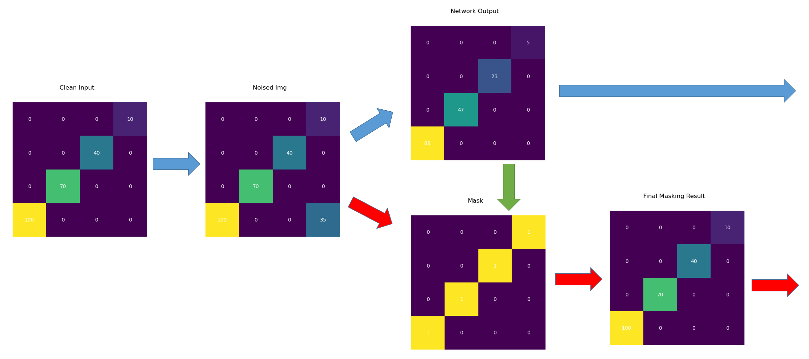

#  DeepClean3D
### Author: Adill Al-Ashgar
#### 3D Neural Denoising for LHCb TORCH at the Large Hadron Collider
#### Department of Physics - University of Bristol, UK 

    - Remove Uncorrelated Photons Detected by TORCH
    - Correct for Chromatic Dispersion and Edge Reflection Effects
    - Automatic Cherenkov Pattern Detection in Three Dimensions (X, Y and ToF)
    - Streamline track reconstruction in preperation for HL-LHC

 

# Usage and Installation 
This readme explains the technical implementation of DEEPCLEAN3D. For installation and usage instructions there are dedicated manuals availible below:

- [Installation Manual](Usage%20Manuals/Installation_Manual.md)
- [Inference Manual](Usage%20Manuals/Inference_Manual.md)
- [Training Manual](Usage%20Manuals/Training_Manual.md)

Or the full documentation is availible as a downloadable PDF file [here](Usage%20Manuals/DeepClean3D%20Documentation.pdf)?????????????????????????????????????????????????.

# Introduction
As part of a planned upgrade for the Large Hadron Collider (LHC), a new subdetector TORCH (Time Of internally Reflected Cherenkov light) is to be added, combining timing information with DIRC-style reconstruction, aiming for a ToF resolution of 10–15 ps (per track). 

The DEEPLCEAN3D (DC3D) project focuses on the processing of data once digitised by the TORCH detectors electronics, to retain readability of this document the specifics of the detector itself and the origin of the data is not discussed in detail, other than as brief overview. As a part of this project a full physical simulation of a single TORCH module in operation was created to generate realistic training data. The simulation is hosted as a standalone repository, [TORCHSIM on GitHub](https://github.com/Adillwma/LHCb_TORCH_Simulation), which focuses specifically on the detector and the mechanis that produces the data. Check it out for a complete breakdown of the TORCH detector and its opperation in the context of the LHCb experiment, if you are unfamilliar with TORCH then this is recomended to fully understand the rest of this document.

TORCH is made up of a bank of photon-multiplier tubes (PMTs), which are sensetive to incoming photons, aranged in a grid/array format. These opperate similarly to pixels of a cameras CCD only 1000x faster, with time resoloution of aporximatly XXXXXXXXXXXXXXXXXXXXXXX. The PMTs are sensetive to incoming photons, for those that arrive the pixel position and the time-of-arrival is recorded. The purpose of TORCH is to measure the velocity of particles produced in the LHCb experiment from which particle identiy can be infered. To do this the path that each photon took through the detector must be reconstructed from the data recorded, a computationally costly process that scales linearly with the number of photons detected. Once all photon paths are reconstructed, only those that are correlated to a particular event are used, the rest are discarded. The number discarded is expected to be around 80\% of the total number of photons, caused by noise and overlapping tracks. After the planned upgrades the LHCb detector is expected to produce up to 500 Tb of data per second, which will be processed in real time, so streamlining the reconstruction process gains importance. 

DC3D aims to remove uncorrelated photons from the PMT array data pre-reconstruction, meaning we do not have the information about each photons path and origin to use in filtering. A neural network was developed in PyTorch to achive this goal The main novel elements presented are in how the data is pre/post-processed, key features and methods employed are outlined in this document. The three main criteria we set out are; decreasing the uncorrelated photons in the data, to not discard or degrade the true correlated photons x,y or ToF values and finally minimal introduction of false positives via processing artefacts that counteract the reduction in noise and could confuse the reconstruction algorithm. So far has demonstrated XXXXXXXXXX sucsess at noise rmeoval whislt retaining xXXXXX percent signal. 

# Table of Contents
- [The DC3D Pipeline](#the-dc3d-pipeline)
    - [Stage 1: 2D with Embedded ToF](#2d-with-embedded-tof)
    - [Stage 2: Signal Degradation & Virtual Dataset Training](#signal-degradation)
    - [Stage 3: Gaped Normalisation](#gaped-normalisation)
    - [Stage 4: DC3D Autoencoder](#dc3d-autoencoder)
        * [Adaptive Class Balanced MSE Loss](#adaptive-class-balanced-mse-loss)
        * [Reconstuctive Autoencoder](#reconstuctive-autoencoder)
    - [Stage 5: Masking Technique](#masking-technique)
    - [Stages 6+: Cutoff Threshold, Renormalisation & 3D Re-encoding](#renomalisation--3d-reconstruction)
- [Results](#results)
- [License](#license)
- [Contributions](#contributions)
- [Contact](#contact)

# The DC3D Pipeline

*The full DC3D input/output processing pipeline around the central Autoencoder (AE). Data flows from left to right and can take two possible paths, 'Direct Output' and 'Masking Output'. Each stage is numbered and explained below*

    1) 2D with embedded ToF: The detector produces 100, 128 x 88 images these are compressed to a single 128 x 88 image using the 2D with embedded ToF technique.

    2) Detector Smearing, Signal Sparsity and Noise are added to the image.

    3) Gaped Normalisation: the image is normalised using the gaped normalisation method.

    4) RAE: the image is processed by the DC3D Autoencoder network, shown in more detail in section \ref{AEDEEP}.

    5) Direct Output: The output of the autoencoder produces the denoised image.

    6) if using the direct method this denoised image is the result and is passed to the re-normalisation in step 10.

    7) If using the masking method the input to the autoencoder is used as the input for masking.

    8) The autoencoders output is used as a mask on the input to recover the correct ToF values.

    9) If using the masking method the output of step 8 is the result and is passed to the re-normalisation in step 10.

    10) Gaped Re-normalisation: Performs the inverse of the gaped normalisation to recover the ToF values.

    11) Inverse 2D with embedded ToF: performs the inverse of the 3D to 2D with embedded ToF to recover the 3D data.

## Stage 1: 2D with embedded ToF

Initially the intention was to use a true 3D autoencoder using 3D convolutional layers to process the data as a 3 dimensional object with x, y and time dimensions. However it was soon found to be very computationally intensive. Using the true x, y dimensions of the detector array, 88 x 128 pixels, and a simplified number of time steps (100) gives 1,126,400 total pixels per 3D image, which results in our autoencoder having 9,341,179 trainable parameters. This is a very large number of parameters and the training time was found to be prohibitively long. The network was also found to be very sensitive to the number of time steps used, with the number of trainable parameters scaling linearly with the number of time steps. This is a problem as the number of time steps is a key parameter in the TORCH detector design and is not easily changed. The number of time steps is determined by the time resolution of the PMTs and the desired ToF resolution. The number of time steps is currently set to XXXXXXXXXXXXXXX???????????????????????????????????????????????????????????????100, which is the minimum number of time steps that can be used to achieve the desired ToF resolution of 10-15 ps. The number of time steps is therefore fixed and cannot be optimised.XXXXXXXXXXXXXXXXXXXXXXXXXXXXXXXX????????????????????????????????

*Left hand image shows one of the simulated crosses in the full three dimensions of x,y and time. The right-hand side shows the same cross image but using our 2D with embedded ToF method, that compresses the three dimensional data to two dimensions to speed up the processing.*

The solution that was found was to reduce the dimensionality of the input data by squashing the time dimension, leaving a 2D image in X,Y. To retain the time information, we turn the time dimension index of any hit into the value that goes into that x,y position in the 2D array. So instead of a 3D array that has zero values for in place of non hits and 1's for hits we now have a 2D array with 0's still encoding non hits and now values between 1 and 100 indicating a hit and the corresponding ToF. This has the effect of reducing the 1m+ total pixels to a more manageable 11,264 and the trainable parameters in the autoencoder to 1,248,251 (an 86.6% decrease over true 3D) which dramatically sped up the processing and training time of the network. 

This 2D with embedded ToF approach does introduce two major downsides. Due to the nature of the flattening process it is susceptible to occlusion of pixels, i.e if there is a noise point with the same x and y position as a signal point but a greater ToF value then it will be the value used in the embedded ToF rather than the signal value behind it. This is not a problem as long as the amount of noise is not too high. We expect around 30 signal points and 200 noise points distributed over the 11,264 pixels in the squashed 2D image. The probability of a significant portion of the signal being covered up is low, however future improvement and a solution to this occlusion is proposed in section \ref{doublemaskmethod}. Additionally, occlusion effects only the ToF recovery of the signal and not the positional recovery, if a noise point occludes a signal point then the pattern retains the exact same x, y pixel configuration now with an eronious ToF value in a pixel. If the signal occludes a noise point it effectivly denoises those points. Siomilarly ifd a noise point occludes another noise point this denoises a point. So the introduced oculsion effect has some possible denoising benefits although they remain unquantified at this time.

The second issue arising from the 2D with embedded ToF is due to the way the hits are now encoded. The input to the neural network has to be normalised to between 0 and 1. In the true 3D network where encoding hits as 0's or 1's there is a clear delineation to the loss function between the two cases. In the 2D embedded method the embedded hits values range from 0 to 100 and after normalisation the ToF values end up ranging from $0 < ToF \leq 1$. This creates a situation where very low ToF values are closer to being 'non-hits' than high ToF values in the eyes of the loss function. The loss function is incentivised toward good reconstruction of high ToF part of a signal. To mitigate this we introduced a method to reinforce the distinction between the non hits and the low ToF value hits we call gaped normalisation which is discussed in section three, [Gaped Normalisation](#gaped-normalisation). 

## Stage 2: Signal Degradation

*Simulated TORCH data. Background noise points are marked in white, signal points are marked in red and lines joining them up demonstrate the charecteristic pattern. The left hand pane shows  simulation without the effects of chromatic dispersion or reflection from the lower edge where the charecteristic pattern becomes visible. The right hand pane shows detector data that includes these effects, the pattern is much harder to make out. TORCH has costly algorithms for correcting for the dispersion and reflection effects but we hope to automatically correct for them in DC3D*

From the pure label data that is taken as input we create the 'simulated' degraded input data that will actually be recived by the netwrok in deployment. This includes three stages:
- Signal rmeoval - The true signal contains many thousands of photons that fill the pattern compleatly. The netwrok will only recive ~ 30 photons per pattern so the true signal is thinned out to randoom values selected from a user input range. 

- Resoloution limiting - Next the data is passed through a function that adds a random x and y shift to each photon in the input signal modeled by a Gaussian distribution. This is to simulate the resolution limitations of a detector. We have demonstrated the newtroks ability to recover the true signal from this degraded input, this has possible application to all detectors and could be used to enhance the physical resolution of a detector through software, a application that we are invetsigating further in a seprate project [PLANEBOOST on GitHub](https://github.com/adillwma/PLANEBOOST).??????????????????????????????????

- Noise addition - Finally the noise is added to the degraded signal. In more general denoising scenarios the level of noise is sufficently high that the distrubution tends towards a gaussian as described by the central limit thorem. In the case of TORCH the level of noise is much lower and the sources are very tightly controlled. For prudence sake, the training and inference software includes a variety of noise profiles that can be mixed to create realistic scenarios, which also improves the netwroks genralisation ability. The number of noise pixels added is determined by a user input range. The noise is added to the degraded signal to create the final input image that is passed to the network for denoising.

*Example of user selectable noise profiles. Amount is exagerated for clearer representation of subtle differences. Further description is available in the Noise_Generators.py file in the repository.*

The way the degradation steps are applied during training is within the main trianing loop. Therfore, randomised values i.e., number of signal and noise points and the choice of photons selected from the filled label are changed each batch, effectivly giving us a near infinate 'virtual dataset' from a small dataset on disk, helping to reduce storage requirments, streamline loading data from disk to memory during training and simplify sending and reciving the datasets during development. This process can also be made fully deterministic is user opts to set a manual seed value in the user settings, and if they have not the random seed values are stored alongside the output so a given virtual dataset can be recalled exactly. This method is possible because each label data file is actually a composite of many thousands of individual results. Just in the signal points variation alone. The number of possible combinations of 30 signal points from a 2000 point pattern is 1.2 x 10^34, giving a probability of 4.7 x 10^-122FORMATTT¬¬!¬!!!!!!!!!!!!!!!!!!!!!!!!!!!!!!!!!!!!!!!!!!!!!!!!!!!!!!!!!!!!!!!!!!!!!!!!!!!!!!!!!!!!!!!!!!!!!!!!!!!!!!!!!!!!!!!!!!!!!!!!!!!!!!!!!!!!!!!!!!!!!!!!!!!!!!!!!!!!!!!!!!!!!!!!!!!!!!!!!!!!!!!!!!!!!!!!!!!!!!!!!!!!!!!!!  for the same set of signal points being chosen twice or more in 1,000,000 attempts. This gives a huge amount of examples of photon locations, however these will all be for one single particle/track and so a dataset larger than one file is required. The datasets used contianed between 10,000 and 250,000 differnt particle/track examples for a broad coverage of possibilities. 

*Example degradation. Exagerated number of photons (~300) retained so that the resoloution limiting is easily visable. Real data has ~ 30 photons, so much more sparse than shown.*

## Stage 3 Gaped Normalisation

A gaped normalisation scheme, eq. \ref{norm eq}, was implemented that aims to create additional separation between non hits and hits, which is especially relevant in the context of our 2D embedded method \ref{2DwToF}. Rather than the standard normalisation that scales an input range from $0-n$ uniformly to $0-1$, the gaped normalisation leaves zero values as zero and compresses non zero values to a range between $r$ and 1, where $r$ is a parameter called the reconstruction threshold ($r$ can take values between 0 and 1 but was found to work best set to 0.5) which results in the normalised data ranging from 0-1 but with the range $0 < x < r$ left empty. This creates a gap between the case of 0 (no hit) and $r$ (lowest ToF hit). The addition of the reconstruction threshold parameter allows the sensitivity of the network to this effect to be set during training.

$$ y = \begin{cases}\frac{(1-r)x}{t} + r & \text{if } 0 < x \leq t \\0 & \text{otherwise} \end{cases} $$

The reconstruction threshold also allows the data to be reconstructed to 3D without a floor of filed pixels. As we are currently using the output values as a mixture between probablitities and ToF values. somthing that needs to be adressed!!!!!!!!!!!!!!!!!!!!

*The effect of the gaped-normlaisation with a user selected reconstruction threshold $r$ of 0.5.*

## Stage 4 DC3D Autoencoder

The Autoencoder network at the heart of DEEPCLEAN3D is a 9 Layer PyTorch Autoencoder with a mixed layer architecture combining the speed and efficeny of convoloutional layers with with the power of fully connected layers around the latent space. The Autoewncoder makes use of ReLu activations to protect from exploding/vanishing gradients and employs droput layers to encorage generalism and stave off overfitting. The network training environment is developed in Python and allows for automatic hyperparameter optimisation whilst also collecting full detailed telemetry and comparative results for further analysis.  The netwrok utiliseds the powerfull ADAM optimiser which makes use of dynamic learning rates and xxxxxxxxxx shown to XXXXXXXXX. The network is currently designed to be very lightweight and all results have been taken with training and inference conducted on a dated consumer Intel i7 8700K CPU, with no GPU acceleration. The network is designed to be easily scalable to larger and more complex infrastructure and is fully CUDA ready for sysstems with GPU accelration availible or deployment in a distributed environment.

### Adaptive Class Balanced MSE Loss
During development the network often only returned when tested with popular loss functions such as MSE and MAE the autoencoder was able to recover the signal, if the data contained many images of only the one signal pattern, which as mentioned results in a very poorly generalisable model is not usefull, but did indicate to us that the network is capable of encoding the pattern. However once shifting and scaling of the cross pattern were introduced it was unable to learn it and began returning blank images. After some research and investigation the problem was found to be an effect known as class imbalance which is an issue that can arise where the interesting features are contained in the minority class \cite{chawla2002smote}. The input image contains 11,264 total pixels and around 230 of them are hits (signal and noise) leaving 98.2\% of pixels as non-hits. For the network, just guessing that all the pixels are non-hits yields a 98.2\% reconstruction loss and it can easily get stuck in this local minima.

Class imbalance most commonly appears in classification tasks such as recognising that an image is of a certain class, i.e. ‘cat’, ‘dog', etc. Classification networks often use cross entropy loss and there are specific modifications of it developed to combat class imbalance, such as focal loss \cite{lin2017focal}, Lovász-Softmax\cite{berman2018lovasz} and class-balanced loss \cite{cui2019class}. We present a new similar method called 'Automatic Class Balanced MSE' (ACB-MSE) which instead, through simple modification of the MSE loss function, provides automatic class balancing for MSE loss with additional user adjustable weighting to further tune the networks response. The function relies on the knowledge of the indices for all hits and non-hits in the true label image, which are then compared to the values in the corresponding index's in the recovered image. The loss function is given by:

$$ \text{Loss} = A(\frac{1}{N _ h}\sum _ {i = 1} ^ {N _ h}(y _ i - \hat{y} _ i) ^ 2) + B(\frac{1}{N _ n}\sum _ {i = 1} ^ {N _ n}(y _ i - \hat{y} _ i) ^ 2) $$

where $y_i$ is the true value of the $i$-th pixel in the class, $\hat{y}_i$ is the predicted value of the $i$-th pixel in the class, and $n$ is the total number of pixels in the class (in our case labeled as $N_h$ and $N_n$ corresponding to 'hits' and 'no hits' classes, but can be extended to n classes). This approach to the loss function calculation takes the mean square of each class separately, when summing the separate classes errors back together they are automatically scaled by the inverse of the class frequency, normalising the class balance to 1:1. The additional coefficients $A$ and $B$ allow the user to manually adjust the balance to fine tune the networks results.

*Figure that demonstrates how each of the loss functions (ACB-MSE, MSE and MAE) behave based on the number of hits in the true signal. Two dummy images were created, the first image contains some ToF values of 100 the second image is a replica of the first but only containing the Tof values in half of the number of pixels of the first image, this simulates a 50% signal recovery. to generate the plot the first image was filled in two pixel increments with the second image following at a constant 50% recovery, and at each iteration the loss functions are calculated for the pair of images. We can see how the MSE and MAE functions loss varies as the size of the signal is increased. Whereas the ACB-MSE loss stays constant regardless of the frequency of the signal class.*

The loss functions response curve is demonstrated in fig \ref{fig:losscurves}. This show how the the ACB-MSE compares to vanilla MSE and also MAE. The addition of ACB balancing means that the separate classes (non hits and hits) are exactly balanced regardless of how large a proportion of the population they are. this means that by guessing all the pixels are non hits results in a loss of 50\% rather than 98.2\%, and to improve on this the network must begin to fill in signal pixels. This frees the network from the local minima of returning blank images and incentives it to put forward its best signal prediction. The addition of the ACB-MSE Loss finally resulted in networks that were able to recover and effectively denoise the input data. The resulting x,y position of the output pixels was measured to be very good and visually the networks were doing a good job of getting close to the right ToF, however, qualitative analysis revealed that the number of pixels with a true ToF value correctly returned was close to zero. To remedy this a novel technique was developed, referred to as 'masking'.

### Reconstructive-Autoencoder (RAE)
Development was focused on the fully filled out cross patterns with around 200 signal points in this early stage to create a strong proof of concept for the general approach. Feeling like this goal had been achieved the data generator was changed to resemble a more realistic scenario displaying only 30 signal points of the 200 along the cross. The AE developed to this point was not able to learn the sparse patterns.

*This series of images shows the degradation steps available to be introduced into the reconstructive learning path, each image is a step on from its left neighbour.*

Taking inspiration from the the ideas behind the DAE and how the network is fed idealised data as a label whist it has noised data presented to it, a new methodology was trialed. The input data was reverted to the fully filled 200 photon cross paths, and additional signal degradation methods were incorporated into the noising phase. The initial trial added a function to dropout lit pixels from the input at random till 30 remain, the network is therefore presented with inputs that contain 30 hits only but gets the full filled cross as the label to compute loss against. This works spectacularly well with the network able to accurately reconstruct the patterns from only 30 signal points whilst also still performing the denosing role. This method returns the full cross pattern rather than the specific photon hits that were in the spare input, however if the later is desired, then the masking method applied to this path results in just the spares photons that fall underneath it in the sparse input image.

*Demonstrating the culmination of the RAE with masking applied to a realistic proportion of 30 signal points and 200 noise points. When using the reconstructive method the direct denoiser output returns the full traced pattern paths which may or may not be of more value then the individual photon hit locations. If this is not the case then the masking method provides a perfect way to recover the exact signal hits only.*

*The results of the RAE applied to the 30 signal and 200 noise points shown in reconstructed 3D. It is important to note that the masked output does not look like the input image because in the case of the reconstructive method the masking recovers only the true signal points incident on the detector not the full pattern, these points are the input image after it has been thinned out by the sparsity function.*

For a final experiment into the possibilities of this reconstructive methodology another degradation layer was Incorporated that adds a random x and y shift to each photon in the input signal modeled by a Gaussian distribution. This is to simulate the resolution limitations of a detector. The network is passed in as input an image with all the photon hits shifted and has the perfect image as its label data for loss calculation, this again shows to be a highly successful methodology and demonstrated an ability to produce a tighter output cross signal than the smeared input. This has possible application to all detectors and could be used to enhance the physical resolution of a detector through software.   

*Image demonstrating the detector resolution recovery. This is not the main application for the program but is presented as an interesting possibility for future follow up.*

This takes us beyond the DAE to a new structure that could be thought of as a Reconstructive Autoencoder or RAE. Similar to a DAE it aims to learn the underlying pattern behind a noised set of data and then attempt to recreate the label target from the noised samples, but in addition to this the RAE can also reconstruct the signal from a degraded set of measurements. 

## Stage 5 Masking Technique

*Illustration of the masking technique developed, shown here for a simple 4x4 input image. The numbers in the centre of the squares indicate the pixel values. The colours just help to visualise these values. The blue arrow path is the standard path for the denosing autoencoder, the red path shows the additional masking steps. the green arrow shows where the mask is taken from the standard autoencoders output and cast over the masking paths input.*

In the traditional approach and what shall be referred to as the 'direct' method the final denoised output is obtained by taking a clean input image, adding noise to it to simulate the detector noise, then passing the noised image as input to the DC3D denoiser, which removes the majority of the noise points and produces the finished denoised image. Although the network produces good x, y reconstruction (demonstrated in section \ref{XXXX}RESULTS at 91\%), and visually the ToF reconstruction is improving to the point that the signal can be visually discerned when compared to the original as shown in fig \ref{FIGURE OF VUSAL TOF BAD DIRECT}, quantitative analysis reveals that the direct output of the network achieves on average 0\% accuracy at finding exact ToF values. To address this problem, we introduce a new technique called ‘masking’.  

The 'masking' method introduces an additional step to the process. Instead of taking the output of the denoiser as the final image, this becomes the 'mask'. The mask is then used on the original noised input image using a process described by equation \ref{masking eq}. 

$$ R = \begin{cases}I & \text{if } M > 0 \\ 0 & \text{otherwise} \end{cases} $$

where $I$ is the input image pixel, $M$ is the corresponding pixel in the mask, and $R$ the pixel in the final output. 

If the mask has a zero value in an index position then the noised input is set to zero in that same index which has the effect of removing the noise. If the mask has a non zero value in it then the value from the corresponding index from the noised input stays as it is, so hits return to having their correct ToF, uncorrupted by the network. An additional benefit of this method is that any additional false positive lit pixels caused by the denoising process will be in the mask and so allow the original value to pass untouched, but the original value in the noised array will be 0 as these points were created by the denoising and so the final output is also automatically cleaned of the majority of denoising artefacts. The two methods are illustrated in fig. \ref{fig:maskingmethod} which shows the direct path in blue arrows and the masking method steps in red.

The masking technique yields perfect ToF recovery for all true signal pixel found, raising ToF recovery from zero to matching the true pixel recovery rate. Computationally, the additional step of casting the mask on the input image to create the masked output is very small compared to the denoising step. To demonstrate this, we timed the two methods (direct denoising vs. denoising + masking) on 1000 test images. The lowest measured run-time for direct denoising was 108.94 ms, and for denoising + masking was 110.29 ms, roughly a 1.24\% increase.

*Shows the 3D reconstruction for the DAE results with masking. The 3D allows the ToF benefits of the masking to be seen properly. This test featured 200 signal points, and a high amount of noise, 1000 points.*

## Stages 6+ Renomalisation & 3D Re-encoding

A corresponding re-normalisation function, eq.\ref{renorm eq}, was created that carries out the inverse of the gaped normalisation, and is used to transform the networks ToF output back to the original range pre-normalisation. Data values below the reconstruction threshold $r$ are set to 0, while values above the threshold are mapped to a range between 0 and the maximum ToF value $t$ based on their distance from the threshold, demonstrated in fig. \ref{fig:reconcuttoff}.

$$ y = \begin{cases}\frac{t(r-x)}{1-r} & \text{if } r < x \leq 1 \\ 0 & \text{otherwise} \end{cases} $$

In equations \ref{norm eq} and \ref{renorm eq}, $x$ represents the input data that is being transformed, $t$ is the number of time steps (in this case 100) and $r$ is the reconstruction threshold.

*The histogram shows the ToF values for all the pixels in the networks raw output before re-normalisation. Values are between 0 and 1 which is shown on the x axis, the number of pixels in each bin are label on the top of each histogram bin. The red line indicates the reconstruction cutoff value, $r$, All points below this cutoff will be set to 0's in the re-normalisation and all points above it will be spread out into the range 1-100 to return the real ToF value.*

# Results:
## Denoising
Talk perfomance results

## Signal Retention
Talk perfomance results

## Signal Enhancement
Talk perfomance results

## Compression
Overall including the 2D with embedded ToF technique and the encoder stage the input data has been compressed from 1,126,400 values (a 8MB file when saved to disk in a .npy container) to just 10 numbers (0.000208Mb as a .npy) which itself could have interesting applications. This encoded data would allow for much faster transfer of data allowing processing to be moved further from the detector, or much reduced data storage requirments. The encoded data could be stored so that individual results can be recalled in full using the decoder if they turn out to be of interest at a later date. There is also the excitin gfpossibility of being able to conduct some processing on the data in its encoded form which is another area we are currently investigating with preliminary results to be relased in early 2024.

# License
This project is not currently licensed. The ACB-MSE loss function is licensed under the MIT License and is available at [ACB-MSE repository](https://github.com/Adillwma/ACB_MSE) and via [PyPi](https://pypi.org/project/ACB-MSE/).

# Contributions
Contributions to this codebase are welcome! If you encounter any issues, bugs or have suggestions for improvements please open an issue or a pull request on the [GitHub repository](https://github.com/Adillwma/DeepClean-Noise-Suppression-for-LHC-B-Torch-Detector).

# Contact
For any further inquiries or for assistance in deploying DC3D, please feel free to reach out to me at adill@neuralworkx.com.

# Acknowledgments
Special thanks to Dr. Jonas Radamaker for his guidance and expertise on LHCb and the TORCH project, Dr. Alex Marshall for his support on getting to grips with PyTorch and troubleshooting, and  Max Carter for his suggestions and dummy signal genrator used in early development.

# Appendix

*Left-hand image shows the 2d flattened data for many charged hadrons passing the quartz in the centre of the block overlayed. with the colour scale indicating the number of detections per pixel. image source: \cite{brook2018testbeam}. Realistic distribution of photon detections taken for one simulated charged hadron passing through the quartz block. The red pixels indicate the ones that are correlated to the charged hadron. The line joining the red points is an aid for the eye to demonstrate that the signal points fall on the characteristic pattern. Image source: \cite{forty2014torch}.*

*The number of iterations required for each processing step of the analytical PDF method Vs the number of photons received from the detector. Shown for a single track and with three particle hypothesises, pion/kaon/proton. Each stage's iterations, $I_1$ through to $I_4$ has its function given on the plot in terms of P the number of photons detected, H the number of hypothesis and T the number of tracks.*

