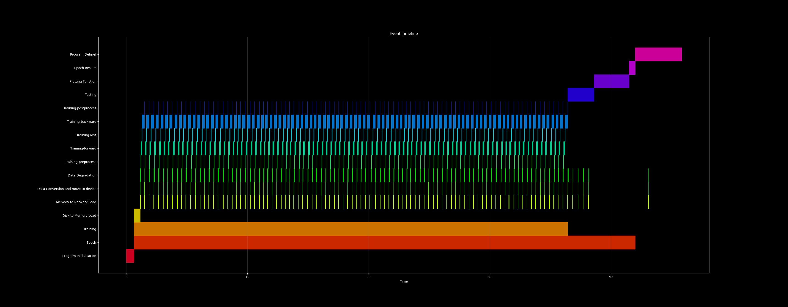

## Dependencies
    graphviz==0.20.1
    librosa==0.10.0.post2
    openpyxl==3.1.2
    pandas==1.5.3
    pickleshare==0.7.5
    Pillow==9.4.0
    tabulate==0.9.0
    torch==2.0.1
    torchinfo==1.8.0
    torchvision==0.15.2
    torchviz==0.0.2
    tqdm==4.65.0
    uproot==5.0.11
    WMI==1.5.1
    XlsxWriter==3.1.0
    zipp==3.16.2


## Install from GitHub
```bash
git clone
cd DC3D_Full
pip install -e .
```

# Quick start for Training
Using the settings guide below set the trainer settings to the desired values.
Then run the file DC3D_V3_Trainer 3.py

This section contains the inputs that the user should provide to the program. These inputs are as follows:

    dataset_title: a string representing the title of the dataset that the program will use.
    model_save_name: a string representing the name of the model that the program will save.
    time_dimension: an integer representing the number of time steps in the data.
    reconstruction_threshold: a float representing the threshold for 3D reconstruction; values below this confidence level are discounted. Must be in range 0 > reconstruction_threshold < 1

    ### Example Code

    # Import the Trainer
    from DC3D_V3 import DC3D_V3_Trainer

    # Set the trainer settings
    dataset_title = "my_dataset"
    model_save_name = "my_new_model"
    time_dimension = 1000
    reconstruction_threshold = 0.5

    # Run the Trainer
    DC3D_V3_Trainer(dataset_title, model_save_name, time_dimension, reconstruction_threshold)

Training can be exited safely at any time after the initial epoch by pressing Ctrl + C. The model will be saved and can be loaded for deployment or to continue training at a later date.

# DC3D Trainer Settings Manual
If you wish to further customise the training process to fine tune to your specific data and use case then the following is a comprehensive list of the availible settings during training. 

### Hyperparameter Settings

This section contains the hyperparameters that the user can adjust to train the model. These hyperparameters are as follows:

    num_epochs: an integer representing the number of epochs for training.
    batch_size: an integer representing the number of images to pull per batch.
    latent_dim: an integer representing the number of nodes in the latent space, which is the bottleneck layer.
    learning_rate: a float representing the optimizer learning rate.
    optim_w_decay: a float representing the optimizer weight decay for regularisation.
    dropout_prob: a float representing the dropout probability.

### Dataset Settings

This section contains the hyperparameters that control how the dataset is split. These hyperparameters are as follows:

    train_test_split_ratio: a float representing the ratio of the dataset to be used for training.
    val_test_split_ratio: a float representing the ratio of the non-training data to be used for validation as opposed to testing.

### Loss Function Settings

This section contains the hyperparameters that control the loss function used in training. These hyperparameters are as follows:

    loss_function_selection: an integer representing the selected loss function; see the program code for the list of options.
    zero_weighting: a float representing the zero weighting for ada_weighted_mse_loss.
    nonzero_weighting: a float representing the nonzero weighting for ada_weighted_mse_loss.
    zeros_loss_choice: an integer representing the selected loss function for zero values in ada_weighted_custom_split_loss.
    nonzero_loss_choice: an integer representing the selected loss function for nonzero values in ada_weighted_custom_split_loss.

### Preprocessing Settings

This section contains the hyperparameters that control image preprocessing. These hyperparameters are as follows:

    signal_points: an integer representing the number of signal points to add.
    noise_points: an integer representing the number of noise points to add.
    x_std_dev: a float representing the standard deviation of the detector's error in the x-axis.
    y_std_dev: a float representing the standard deviation of the detector's error in the y-axis.
    tof_std_dev: a float representing the standard deviation of the detector's error in the time of flight.

### Pretraining Settings

This section contains the hyperparameters that control pretraining. These hyperparameters are as follows:

    start_from_pretrained_model: a boolean representing whether to start from a pretrained model.
    load_pretrained_optimser: a boolean representing whether to load the pretrained optimizer.
    pretrained_model_path: a string representing the path to the saved full state dictionary for pretraining.

### Normalisation Settings

This section contains the hyperparameters that control normalization. These hyperparameters are as follows:

    simple_norm_instead_of_custom: a boolean representing whether to use simple normalization instead of custom normalization.
    all_norm_off: a boolean representing whether to use any input normalization.
    simple_renorm: a boolean representing whether to use simple output renormalization instead of custom output renormal


# Data loading
DC3D Uses a custom data loader to load the data into the model. This data loader is designed to be as efficient as possible and to allow for the loading of large datasets, using a buffered shuffleable dataset with tiered memory, async data loading and multiprocessing. 

### Expected formats for data files and folder structure
The individual data samples used in the training are of shape 88x128, storing these files on disk individually results in files of size ~ 0.98mb each. The standard PyTorch dataloader loads these files one by one from disk to construct the batches it provides. Even using NVMe SSD storage for the dataset, the repeated small reads proved to be a bottleneck when using larger datsets of 500k+ samples. To overcome this i/o bottleneck and repeated disk reads I moved to storing datafiles on disk in 'bundles' essentiall large batches of data stored in a single file. This allows for the dataloader to read the entire bundle in one go, reducing the number of disk reads.In order to further reduce unnessecary repetition of pre_processing the data is pre stored as torch tensors and the tensor includes the channel dimension ready for porcessing. This neccesitates the data files on disk be torch tensors saved in the .pt format, with shape (N, C, H, W) where N is the number of files in the bundle, C is the number of channels which should always bbe set to 1, H is the height of the image which should be 88px and W is the width of the image, 128px. 

In order to load the data into the model, the user must provide the path to the data in the form of a folder using the imagenet format, i.e structured as follows:

    Dataset_Folder_Path
    ├── Data
    │   ├── Data_0.pt 
    │   ├── Data_1.pt

where 'Dataset_Folder_Path' is the name of your dataset folder passed to the training program and each of the data files should be torch tensor bundle, with shape (N, C, H, W) as discussed.

The bundle size you use is up to you however all the files should have the same size, and this value must be enterred into the large_bundle_size' variable in the training settings. The recomended bundle size is 10,000 files which resultsin .pt files of 960mb each. If you are generating your own data and it is stored in individual 88x128 numpy files then you can use the provided dataset update tool to convert it to the required format choosing a bundle size that suits your needs.

### Tiered Loading
The custom datalaode rmakes use of two datalaoders in series which are used to load the data in a tiered manner. The first dataloader loads the data from the disk into memory in large bundles, reducing the i/o opperations. The second loader handles the logic, presenting to the main network and program like a run of the mill datalaoder, whilst collecting data from files in memory.

#### Shuffle
Handling shuffling is one of the complications of such a system, if true random indexing is allowed then the system may well need to call bundle 1 for a single file and then bundle 3 for the following, resulting in a huge perfromance hit over storing files individually due the increased size. To overcome this the dataloader uses seperate shuffling acorss bundles and within bundles, this allows for shuffling that randomises the order of the bundles each epoch and the order of the files within each bundle. Whilst it is not perfect it is sufficent with large bundle sizes. 

### Async Queue and Workers
Coming Soon....

### Device 
The dataloader is capable of preloading data directly to your compute device if using a GPU, this also performs the data pre-processing on the GPU, reducing the load on the CPU. This needs to be tested for your specific hardware configuration and depends on whether you are CPu or GPU limited during training.To enable this feature set the 'preprocess_on_gpu' variable to True in the trainer settings and make sure you have an supported GPU.


# Compute Performance: Tuning and Measurment

### Built in Execution Timer 

The built in execution timer is a simple way to visulising the execution time of each component of the training stack and can be used to identify bottlenecks in Dataloading, Model Training, Validation and Testing on your hardware. It is also usefull in dignosing and tuning the workers and async queue sizes for optimal performance.

The execution timer is already implemented and can be activated by setting the 'execution_timer' variable to True in the trainer settings. When set to true the timing information is automatically gathered and then saved to a plot in the output folder within the output_graphics subdirectory once the program training has concluded.

    execution_timer = True

If implmenting additonal code modules to the training stack, these can be added to the execution timer using the following format:

    # Initialise an execution timer start event
    execution_timer.record_time(event_name="Plotting Function", event_type="start") 

    # Add your code here
    ### CODE ###

    # Send an execution timer stop event
    execution_timer.record_time(event_name="Plotting Function", event_type="stop")

For further information on the execution timer, or how to use it please refer to the standalone execution timer repo [here](Execution_Timer.md)????

<div align="center">



*Example of resultant plot from the execution timer.*
</div>

### torch.profiler

The torch.profiler is specifically designed for profiling PyTorch code, capturing detailed information about CPU and GPU operations, tensor shapes, memory usage, and more. It provides detailed profiling for CUDA operations, which is essential for understanding and optimising the usage of your GPU during training. The torch.profiler can output traces that can be visualized in TensorBoard, allowing for an in-depth analysis of model performance, including timelines of operations and kernel execution. This can be activated by setting the 'torch_profiler' variable to True in the trainer settings,

    torch_profiler = True

and the torch_profiler_log_tensorboard variable to True if you wish to output the results to tensorboard. Additionally allows for advanced profiling schedules, such as waiting, warming up, and active profiling periods and captures stack traces for operations, aiding in identifying the source of performance bottlenecks.

### cProfile

cProfile is a general-purpose profiler included in the Python standard library. It profiles the execution of Python programs, capturing function call counts and execution times. It does not provide detailed information about GPU operations however it profiles code execution at the function level, providing statistics such as the number of calls and the total/average time spent in each function, usefull for simple debugging and performance profiling pre- and post-processing code. cProfile can be activated by setting the 'cprofile' variable to True in the trainer settings.
    
        cprofile = True


