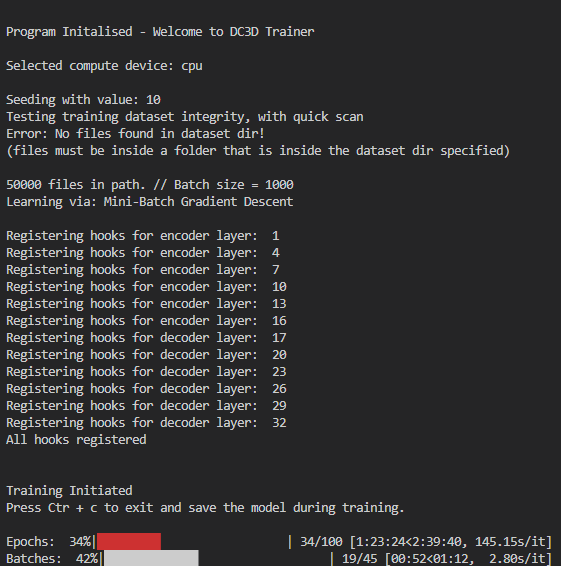

<div align="center">



*Main DeepClean3D trainer program, terminal based execution.*
</div>


# Installation

## Dependencies
    graphviz==0.20.1
    librosa==0.10.0.post2
    openpyxl==3.1.2
    pandas==1.5.3
    pickleshare==0.7.5
    Pillow==9.4.0
    tabulate==0.9.0
    torch==2.0.1
    torchinfo==1.8.0
    torchvision==0.15.2
    torchviz==0.0.2
    tqdm==4.65.0
    uproot==5.0.11
    WMI==1.5.1
    XlsxWriter==3.1.0
    zipp==3.16.2


## Install from GitHub
```bash
git clone
cd DC3D_Full
pip install -e .
```

# Quick start for Training
Using the settings guide below set the trainer settings to the desired values.
Then run the file DC3D_V3_Trainer 3.py

This section contains the inputs that the user should provide to the program. These inputs are as follows:

    dataset_title: a string representing the title of the dataset that the program will use.
    model_save_name: a string representing the name of the model that the program will save.
    time_dimension: an integer representing the number of time steps in the data.
    reconstruction_threshold: a float representing the threshold for 3D reconstruction; values below this confidence level are discounted. Must be in range 0 > reconstruction_threshold < 1

    ### Example Code

    # Import the Trainer
    from DC3D_V3 import DC3D_V3_Trainer

    # Set the trainer settings
    dataset_title = "my_dataset"
    model_save_name = "my_new_model"
    time_dimension = 1000
    reconstruction_threshold = 0.5

    # Run the Trainer
    DC3D_V3_Trainer(dataset_title, model_save_name, time_dimension, reconstruction_threshold)

Training can be exited safely at any time after the initial epoch by pressing Ctrl + C. The model will be saved and can be loaded for deployment or to continue training at a later date.

If using one of the provided example datasets, availible via: LINK TO DATASETS!, you can run the training. To create your own datsets, please read the following section on data loading.

# Data loading
DC3D Uses a custom data loader to load the data into the model. This data loader is designed to be as efficient as possible and to allow for the loading of large datasets, using a buffered shuffleable dataset with tiered memory, async data loading and multiprocessing. 

### Expected formats for data files and folder structure
The individual data samples used in the training are of shape 88x128, storing these files on disk individually results in files of size ~ 0.98mb each. The standard PyTorch dataloader loads these files one by one from disk to construct the batches it provides. Even using NVMe SSD storage for the dataset, the repeated small reads proved to be a bottleneck when using larger datsets of 500k+ samples. To overcome this i/o bottleneck and repeated disk reads I moved to storing datafiles on disk in 'bundles' essentiall large batches of data stored in a single file. This allows for the dataloader to read the entire bundle in one go, reducing the number of disk reads.In order to further reduce unnessecary repetition of pre_processing the data is pre stored as torch tensors and the tensor includes the channel dimension ready for porcessing. This neccesitates the data files on disk be torch tensors saved in the .pt format, with shape (N, C, H, W) where N is the number of files in the bundle, C is the number of channels which should always bbe set to 1, H is the height of the image which should be 88px and W is the width of the image, 128px. 

In order to load the data into the model, the user must provide the path to the data in the form of a folder using the imagenet format, i.e structured as follows:

    Dataset_Folder_Path
    ├── Data
    │   ├── Data_0.pt 
    │   ├── Data_1.pt

where 'Dataset_Folder_Path' is the name of your dataset folder passed to the training program and each of the data files should be torch tensor bundle, with shape (N, C, H, W) as discussed.

The bundle size you use is up to you however all the files should have the same size, and this value must be enterred into the large_bundle_size' variable in the training settings. The recomended bundle size is 10,000 files which resultsin .pt files of 960mb each. If you are generating your own data and it is stored in individual 88x128 numpy files then you can use the provided dataset update tool to convert it to the required format choosing a bundle size that suits your needs.

### Tiered Loading
The custom datalaode rmakes use of two datalaoders in series which are used to load the data in a tiered manner. The first dataloader loads the data from the disk into memory in large bundles, reducing the i/o opperations. The second loader handles the logic, presenting to the main network and program like a run of the mill datalaoder, whilst collecting data from files in memory.

### Shuffle
Handling shuffling is one of the complications of such a system, if true random indexing is allowed then the system may well need to call bundle 1 for a single file and then bundle 3 for the following, resulting in a huge perfromance hit over storing files individually due the increased size. To overcome this the dataloader uses seperate shuffling acorss bundles and within bundles, this allows for shuffling that randomises the order of the bundles each epoch and the order of the files within each bundle. Whilst it is not perfect it is sufficent with large bundle sizes and can be activated by setting the 'shuffle' variable to True in the trainer settings.

    shuffle = True

### Async Queue and Workers
Coming Soon....

    async_loader = True
    async_queue_size = 4
    buffer_size = 4


### Device 
The dataloader is capable of preloading data directly to your compute device if using a GPU, this also performs the data pre-processing on the GPU, reducing the load on the CPU. This needs to be tested for your specific hardware configuration and depends on whether you are CPu or GPU limited during training.To enable this feature set the 'preprocess_on_gpu' variable to True in the trainer settings and make sure you have an supported GPU.

    preprocess_on_gpu = True


# Compute Performance: Tuning and Measurment

### Built in Execution Timer 

The built in execution timer is a simple way to visulising the execution time of each component of the training stack and can be used to identify bottlenecks in Dataloading, Model Training, Validation and Testing on your hardware. It is also usefull in dignosing and tuning the workers and async queue sizes for optimal performance.

The execution timer is already implemented and can be activated by setting the 'execution_timer' variable to True in the trainer settings. When set to true the timing information is automatically gathered and then saved to a plot in the output folder within the output_graphics subdirectory once the program training has concluded.

    execution_timer = True

If implementing additonal code modules to the training stack, these can be added to the execution timer using the following format:

    # Initialise an execution timer start event
    execution_timer.record_time(event_name="Plotting Function", event_type="start") 

    # Add your code here
    ### CODE ###

    # Send an execution timer stop event
    execution_timer.record_time(event_name="Plotting Function", event_type="stop")

For further information on the execution timer, or how to use it please refer to the standalone execution timer repo [here](Execution_Timer.md)????

<div align="center">


*Example of resultant plot from the execution timer.*
</div>

### torch.profiler

The torch.profiler is specifically designed for profiling PyTorch code, capturing detailed information about CPU and GPU operations, tensor shapes, memory usage, and more. It provides detailed profiling for CUDA operations, which is essential for understanding and optimising the usage of your GPU during training. The torch.profiler can output traces that can be visualized in TensorBoard, allowing for an in-depth analysis of model performance, including timelines of operations and kernel execution. This can be activated by setting the 'torch_profiler' variable to True in the trainer settings,

    torch_profiler = True

and the torch_profiler_log_tensorboard variable to True if you wish to output the results to tensorboard. Additionally allows for advanced profiling schedules, such as waiting, warming up, and active profiling periods and captures stack traces for operations, aiding in identifying the source of performance bottlenecks.

### cProfile

cProfile is a general-purpose profiler included in the Python standard library. It profiles the execution of Python programs, capturing function call counts and execution times. It does not provide detailed information about GPU operations however it profiles code execution at the function level, providing statistics such as the number of calls and the total/average time spent in each function, usefull for simple debugging and performance profiling pre- and post-processing code. cProfile can be activated by setting the 'cprofile' variable to True in the trainer settings.
    
        cprofile = True


# DC3D Trainer Full Settings List
If you wish to further customise the training process to fine tune to your specific data and use case then the following is a comprehensive list of the availible settings during training. 

---

#### Initial Machine Setup

**`data_path`**
- **Description**: Path to the folder containing dataset folders.
- **Usage**: Allows quick switching between datasets by changing the dataset title without modifying the full path.
- **Default**: `"C:\\Datasets\\"`

**`results_output_path`**
- **Description**: Path to the folder containing all results folders.
- **Usage**: Stores results for different runs, facilitating organized output management.
- **Default**: `"C:\\Results\\"`

---

#### Run Basic Setup

**`dataset_title`**
- **Description**: Name of the dataset folder. Set to switch between different datasets.
- **Usage**: String representing the dataset folder path.
- **Default**: `"[V3]_RDT_50K"`

**`model_save_name`**
- **Description**: Name for saving the model.
- **Usage**: Helps identify different model versions.
- **Default**: `"TEST_001"`

**`model_checkpointing`**
- **Description**: Enable or disable model checkpointing.
- **Usage**: Saves model state at intervals for backup. Accepts True or False.
- **Default**: `True`

**`model_checkpoint_interval`**
- **Description**: Interval (in epochs) for saving checkpoints.
- **Usage**: Determines how often to save checkpoints.
- **Default**: `10`

**`timeout_training`**
- **Description**: Enables stopping of training after a specified timeout.
- **Usage**: Accepts True or False.
- **Default**: `False`

**`timeout_time`**
- **Description**: Specifies the timeout duration in minutes if `timeout_training` is enabled.
- **Usage**: Accepts numerical integer value representing the maximum time allowed for training in minuits.
- **Default**: `720` 

---

#### Data Loader Settings

**`preprocess_on_gpu`**
- **Description**: Preprocess data in data loader on GPU if available.
- **Usage**: Move pre-processing from CPU to GPU if possible. Accepts True or False.
- **Default**: `False`

**`inject_seed`**
- **Description**: The number of epochs between reinjecting torch & numpy seeding values.
- **Usage**: Explained in detail in the section on !!!!! Set to a numerical value to inject seed at that interval, **OR** set to False to disable seed reinjection. 
- **Default**: `3` **OR** `False`

**`inject_seed_interval`**
- **Description**: Interval (in epochs) for seed reinjection.
- **Usage**: Frequency of reinjecting the seed.
- **Default**: `10`

**`shuffle_train_data`**
- **Description**: Shuffle training data each epoch.
- **Usage**: Enhances training by varying data order, explained in greater detail in section on Dataloading !. Accepts True or False.
- **Default**: `False`

**`large_data_bundles_size`**
- **Description**: Size of data bundles loaded into memory.
- **Usage**: The number of files per data bundle on disk. Explained in detail in the section on Dataloading !
- **Default**: `10000`

**`number_of_bundles_to_memory`**
- **Description**: Number of data bundles loaded simultaneously.
- **Usage**: Adjusts the memory footprint of data loading. Recomended to fill 1/4 of availible memory on device, i.e if 32GB availible allow for ~8GB of data to be loaded at once. Bundles of 10,000 files are ~ 960mb each.
- **Default**: `8`

**`data_loader_workers`**
- **Description**: Number of workers for data loading.
- **Usage**: Controls parallel data loading to improve speed. Set to 0 to use no multithread workers, 1 to use a single worker, etc. Recomeneded to set equal to number of CPU cores. 
- **Default**: `0`

---

#### Input Data Settings

**`TORCHSIM_data`**
- **Description**: Flag for TORCHSIM data usage.
- **Usage**: Enable if using TORCHSIM data, discussed in the section on !!!!!. Accepts True or False.
- **Default**: `False`

**`time_dimension`**
- **Description**: Number of time steps in data.
- **Usage**: Sets the temporal resolution.
- **Default**: `1000`

**`xdim`**
- **Description**: Input data width.
- **Usage**: This value should be set to 88 for TORCH. If working on different data, set to the appropriate value for the x dimension, which will require modification of the neural network layers to accomedate the new shape.
- **Default**: `88`

**`ydim`**
- **Description**: Input data height.
- **Usage**: This value should be set to 128 for TORCH. If working on different data, set to the appropriate value for the y dimension, which will require modification of the neural network layers to accomedate the new shape.
- **Default**: `128`

**`channels`**
- **Description**: Number of data channels.
- **Usage**: This value should be set to 1 for TORCH. If working on different data, set to the appropriate number of channels, which will require modification of the neural network layers to accomedate the new shape.
- **Default**: `1`

---

#### Training Hyperparameter Settings

**`num_epochs`**
- **Description**: Number of training epochs.
- **Usage**: Controls the number of epochs executed during training before it will automatically conclude. 
- **Default**: `100`

**`batch_size`**
- **Description**: Number of data samples processed by the network per batch.
- **Usage**: Adjusts the size of data batches during training.
- **Default**: `1000`

**`learning_rate`**
- **Description**: Optimizer learning rate.
- **Usage**: Sets the step size for optimizer updates. As we are using the Adam optimizer, which includes adaptive learning rates, this value is the initial learning rate.
- **Default**: `0.0001`

**`optim_w_decay`**
- **Description**: Weight decay for regularization.
- **Usage**: Helps prevent overfitting by adding a penalty term to the loss function. This term discourages the weights from becoming too large. The weight decay parameter controls the strength of this penalty.
- **Default**: `1e-05`

**`precision`**
- **Description**: Data and model precision in bits (16, 32, or 64).
- **Usage**: Defines numerical precision used in computations. Increased precision can improve accuracy but requires more memory and computational resources, slowing training. NOTE: 16-bit is only available on supported GPUs.
- **Default**: `32`

---

#### Architecture Settings

**`latent_dim`**
- **Description**: Number of nodes in the latent space.
- **Usage**: Adjusts the model's bottleneck layer size.
- **Default**: `15`

**`fc_input_dim`**
- **Description**: Number of nodes in the fully connected layer.
- **Usage**: Defines the size of the dense fully connected linear layers.
- **Default**: `124`

**`dropout_prob`**
- **Description**: Dropout probability.
- **Usage**: Sets the probability of dropout, used to add further regularization. Dropout randomly sets a fraction of input units to zero at each update during training, which helps prevent overfitting by encoraging redundant dependencies between neurons.
- **Default**: `0.2`

**`reconstruction_threshold`**
- **Description**: Threshold for signal reconstruction.
- **Usage**: Set between 0 < reconstruction_threshold <= 1. Filters out low-confidence values. Values below this threshold are not considered. This opperates in conjuction with the normalisation routine as explained in the main DC3D Readme, in section !!!!!
- **Default**: `0.5`

---

#### Dataset Settings

**`train_test_split_ratio`**
- **Description**: Ratio of data used for training, vs. testing.
- **Usage**: Determines train/test split of the dataset folder presented to the program. Accepts a float between 0 and 1 as a decimal percentage, i.e 0.9 is 90% training data, 10% testing data.
- **Default**: `0.9`

---

#### Loss Function Settings

**`loss_function_selection`**
- **Description**: Select the loss function.
- **Usage**: Defines the loss function to be used.
- **Default**: `"ACB_MSE"`

**`loss_vs_sparse_img`**
- **Description**: Calculate loss against sparse or full image.
- **Usage**: Chooses the type of image used for loss calculation. Accepts True or False.
- **Default**: `False`

**`renorm_for_loss_calc`**
- **Description**: Calculate loss against renormalized image.
- **Usage**: Decides if renormalization is applied before loss calculation. Accepts True or False.
- **Default**: `False`

#### ACB_MSE Extra Loss Settings

**`zero_weighting`**
- **Description**: Weight for zero values in ACBMSE.
- **Usage**: Adjusts the impact of zero values in the loss function, i.e. the loss calculated by comparing the zero values in the input to thier conterpart indexs in the output.
- **Default**: `1`

**`nonzero_weighting`**
- **Description**: Weight for non-zero values in ACBMSE.
- **Usage**: Adjusts the impact of non-zero values in the loss function, i.e. the loss calculated by comparing the non-zero values in the input to thier conterpart indexs in the output.
- **Default**: `1`

**`fullframe_weighting`**
- **Description**: Weight for full frame in ffACBMSE.
- **Usage**: Adjust the weighting for the full frame loss, i.e the loss calulated comparing the entire frames. Specific to ffACBMSE loss function.
- **Default**: `1`

**`ff_loss`**
- **Description**: Loss function to be applied to the calculation of the full frame loss.
- **Usage**: Select loss function from list: `mse`, `mae`, `etc`...!?!!?
- **Default**: `"mse"`

**`zeros_loss_choice`**
- **Description**: Loss function for zero values.
- **Usage**: Select loss function from list: `mse`, `mae`, `etc`...!?!!?
- **Default**: `1`??

**`nonzero_loss_choice`**
- **Description**: Loss function for non-zero values.
- **Usage**: Select loss function from list: `mse`, `mae`, `etc`...!?!!?
- **Default**: `1`??

---

#### Image Preprocessing Settings

**`signal_points`**
- **Description**: Number of signal points to reduce the data to during preprocessing. Explained in detail in the section on !!!!!
- **Usage**: Set to numerical value i.e 30 to define a fixed number of signal points, **OR** set to a tuple i.e (25,35) to set fixed bounds for the parameter which will be randomised for each sample **OR** set to False to disable signal point reduction and keep the input fully populated.
- **Default**: `30`

**`noise_points`**
- **Description**: Number of noise points to add to the data samples.
- **Usage**: If set to 0, no noise will beb added and the fucntion will be bypassed. Set to a numerical value greater than 0 i.e 200 to define a fixed number of noise points, **OR** set to a tuple i.e (150,250) to set fixed bounds for the parameter which will be randomised for each sample.
- **Default**: `200`

**`x_std_dev`**
- **Description**: Standard deviation of detector in x-axis in nm, i.e. 0.1nm. Used to smear the input data to simulate effect of resolution limits and detector error. 
- **Usage**: Adds smearing in the x-axis. Set to 0 to disable. Set to a numerical value greater than 0 i.e 0.1 to define a fixed value, **OR** set to a tuple i.e (0.05,0.15) to set fixed bounds for the parameter which will be randomised for each sample.
- **Default**: `0`

**`y_std_dev`**
- **Description**: Standard deviation of detector in y-axis in nm, i.e. 0.1nm. Used to smear the input data to simulate effect of resolution limits and detector error.
- **Usage**: Adds smearing in the y-axis. Set to 0 to disable. Set to a numerical value greater than 0 i.e 0.1 to define a fixed value, **OR** set to a tuple i.e (0.05,0.15) to set fixed bounds for the parameter which will be randomised for each sample.
- **Default**: `0`

**`tof_std_dev`**
- **Description**: Standard deviation of detector in time of flight measurment, i.e. 0.1ns. Used to smear the input data to simulate effect of resolution limits and detector error.
- **Usage**: Adds smearing in the time of flight axis. Set to 0 to disable. Set to a numerical value greater than 0 i.e 0.1 to define a fixed value, **OR** set to a tuple i.e (0.05,0.15) to set fixed bounds for the parameter which will be randomised for each sample.
- **Default**: `0`

---

#### Pretraining Settings

**`start_from_pretrained_model`**
- **Description**: Load pretrained model and optimizer states.
- **Usage**: Initializes model with pretrained weights. Accepts True or False.
- **Default**: `False`

**`load_pretrained_optimser`**
- **Description**: Load pretrained optimizer state.
- **Usage**: If the 'start_from_pretrained_model' is True, this setting also loads the pretrained optimizer state. Accepts True or False.
- **Default**: `True`

**`pretrained_model_path`**
- **Description**: Path to pretrained model state dict.
- **Usage**: Specifies location of pretrained model. Must be set if 'start_from_pretrained_model' is True.
- **Default**: `"C:\\Results\\Test_001\\Model + Optimiser State Dicts.pth"`


---

#### Normalisation Settings

**`masking_optimised_binary_norm`**
- **Description**: Toggles between binary normalisation optimized for masking output and gaped custom normalisation optimized for direct network output.
- **Usage**: Enhances model performance by selecting the appropriate normalisation method.
- **Default**: `False`

---

#### Plotting Control Settings

**`print_every_other`**
- **Description**: Determines the frequency of training plot generation during training. Sets the number of epochs bbetween detailed plot generation, i.e 1 will print every epoch, 2 will print every other epoch, etc.
- **Usage**: Helps manage the amount of plot data generated during training.
- **Default**: `1`

**`plot_or_save`**
- **Description**: Controls whether plots are saved, displayed, or both.
- **Usage**: Manages the output and visualization of plots during training. Accepts: 0 which display plots, blocking training till closed. 1 which saves plots to disk, non blocking. or 2 which saves plots to disk and then displays them, blocking training till closed.
- **Default**: `1`

**`num_to_plot`**
- **Description**: Specifies the number of examples to use in the 2D comparison plot.
- **Usage**: Limits the amount of plot data for visualization.
- **Default**: `10`

**`save_all_raw_plot_data`**
- **Description**: Saves all raw data used to create plots to disk for later replotting and analysis.
- **Usage**: Accepts True or False. Use if desiring to retain raw data for post-training analysis and replotting using new techniques not yet implemented.
- **Default**: `False`


#### Neural Net Telemetry

**`record_weights`**
- **Description**: Records the weights of the network at the end of each epoch. Facilitates detailed analysis of network changes over time.
- **Usage**: Accepts True or False.
- **Default**: `True`

**`record_biases`**
- **Description**: Records the biases of the network at the end of each epoch. Allows tracking of bias adjustments during training.
- **Usage**: Accepts True or False.
- **Default**: `True`

**`record_activity`**
- **Description**: Records the activations of the network at the end of each epoch. Useful for analyzing the network’s internal activity.
- **Usage**: Accepts True or False.
- **Default**: `True`

**`flush_network_hooks`**
- **Description**: Flushes network hooks to disk periodically to reduce memory usage. 
- **Usage**: Accepts True or False.
- **Default**: `True`

**`hook_flush_interval`**
- **Description**: Sets the number of epochs between each flush of the network hooks. Balances memory usage and training speed by controlling when data is written to disk.
- **Usage**: Numerical integer value representing the number of epochs between hook data being flushed to disk.
- **Default**: `1` 

**`hook_max_memory_usage`**
- **Description**: Specifies the maximum memory usage in GB before hooks are forcibly flushed to disk. Prevents excessive memory usage by hard limiting the memory usage of the network hooks.
- **Usage**: Numerical value in GB. 
- **Default**: `0.5`

---

#### Physical Grounding for Units

**`use_physical_values_for_plot_axis`**
- **Description**: Labels plot axes by physical units instead of pixel indices, providing more meaningful plot axes for physical data interpretation.
- **Usage**: Accepts True or False.
- **Default**: `True`

**`x_length`**
- **Description**: Length of the x-axis in physical units. Defines the physical scale for the x-axis in the input data.
- **Usage**: Numerical value representing the length of the x-axis in mm. For a single TORCH module this should be 800mm.
- **Default**: `800`

**`y_length`**
- **Description**: Length of the y-axis in physical units. Defines the physical scale for the y-axis in the input data.
- **Usage**: Numerical value representing the length of the y-axis in mm. For a single TORCH module this should be 800mm.
- **Default**: `1500` 

**`time_length`**
- **Description**: Length of the time axis in physical units. Defines the physical scale for the time axis in the input data.
- **Usage**: Numerical value representing the range of the time axis in ns.
- **Default**: `1000` 

---

#### Advanced Visualization Settings

**`plot_train_loss`**
- **Description**: Plots training loss vs epoch number and training loss vs time once training has concluded for better understanding of model performance during training.
- **Usage**: Accepts True or False.
- **Default**: `True`

**`plot_test_loss`**
- **Description**: Plots test loss vs epoch number and vs time once training has concluded for better understanding of model performance during the testing stages. Inverse gradients between training and testing loss plots is a sure indication of overfitting!
- **Usage**: Accepts True or False.
- **Default**: `True`

**`plot_validation_loss`**
- **Description**: Enables plotting of validation loss, only used if training is optimising hyperparameters.
- **Usage**: Visualizes the validation loss for model tuning.
- **Default**: `True`

**`plot_detailed_performance_loss`**
- **Description**: Plots detailed performance metrics for each epoch. Includes MAE, MSE, SSIM, NMI, SNR, PSNR, Correlation Coefficient, and in house metrics, explained in the section on !!!!!
- **Usage**: Accepts True or False.
- **Default**: `True`

**`plot_normalised_radar`**
- **Description**: Enables plotting of normalized radar plots. Visualizes the detailed performance metrics as a normalised radar plot for cross-metric comparison and analysis. 
- **Usage**: Accepts True or False. NOTE: Requires 'plot_detailed_performance_loss' to be True.
- **Default**: `False`

**`plot_live_time_loss`**
- **Description**: Generates a live plot of training loss vs time, updated to disk each epoch for tracking progress during training.
- **Usage**: Accepts True or False.
- **Default**: `True`

**`plot_live_training_loss`**
- **Description**: Generates a live plot of training loss vs epoch number, updated to disk each epoch for tracking progress during training.
- **Usage**: Accepts True or False.
- **Default**: `True`

**`plot_comparative_loss`**
- **Description**: Enables plotting of comparative loss metrics.
- **Usage**: Compares the current model's performance with other models.
- **Default**: `True`

**`comparative_live_loss`**
- **Description**: Adds comparative lines to live plots for performance comparison.
- **Usage**: Enhances real-time visualization by adding comparative benchmarks.
- **Default**: `True`

**`slide_live_plot_size`**
- **Description**: Number of epochs to show on the live plot.
- **Usage**: Controls the window size of epochs displayed in live plots.
- **Default**: `0` (shows all epochs)

**`comparative_loss_titles`**
- **Description**: Titles for comparative loss models.
- **Usage**: Identifies different models in comparative plots.
- **Default**: `["S1 10K", "S1 100K", "S1 500K", "S2 10K"]`

**`comparative_loss_paths`**
- **Description**: Paths to comparative loss model results.
- **Usage**: Specifies locations of comparative model results for plotting.
- **Default**: `[r'N:\\Yr 3 Project Results\\RDT 10K 1000ToF timed - Training Results\\', ...]`

**`plot_pixel_threshold_telemetry`**
- **Description**: Enables plotting of pixel threshold telemetry.
- **Usage**: Visualizes pixel-based performance metrics.
- **Default**: `True`

**`plot_pixel_difference`**
- **Description**: Enables plotting of pixel difference metrics.
- **Usage**: Analyzes differences in pixel values between epochs.
- **Default**: `False`

**`plot_latent_generations`**
- **Description**: Enables plotting of latent space generations.
- **Usage**: Visualizes latent space representations during training.
- **Default**: `True`

**`plot_higher_dim`**
- **Description**: Enables plotting in higher dimensions.
- **Usage**: Visualizes higher-dimensional data.
- **Default**: `False`

**`plot_Graphwiz`**
- **Description**: Enables Graphviz plots for network architecture visualization. Provides a visual representation of the network structure.
- **Usage**: Accepts True or False.
- **Default**: `True`

**`use_tensorboard`**
- **Description**: Enables TensorBoard integration for logging and visualization for those more familiar with the TensorBoard interface.
- **Usage**: Accepts True or False.
- **Default**: `False`

---

#### Advanced Debugging Settings

**`print_encoder_debug`**
- **Description**: Prints debug information for the encoder. Aids in debugging encoder-related issues whilst setting layer sizes etc.
- **Usage**: Accepts True or False.
- **Default**: `False`

**`print_decoder_debug`**
- **Description**: Prints debug information for the decoder. Aids in debugging decoder-related issues whilst setting layer sizes etc.
- **Usage**: Accepts True or False.
- **Default**: `False`

**`print_network_summary`**
- **Description**: Prints the neural network summary to the terminal using torchinfo before training begins. 
- **Usage**: Accepts True or False.
- **Default**: `False`

**`print_partial_training_losses`**
- **Description**: Prints training loss for each batch in the epoch to terminal. This will remove the progress bar. Useful for debugging and understanding the loss function. Not advised during normal training.
- **Usage**: Accepts True or False.
- **Default**: `False`

**`debug_noise_function`**
- **Description**: Prints debug information for the noise function.
- **Usage**: Useful for diagnosing issues with noise handling.
- **Default**: `False`

**`debug_model_exporter`**
- **Description**: Prints debug information for model exporting.
- **Usage**: Helps in troubleshooting model export processes.
- **Default**: `False`

**`full_dataset_integrity_check`**
- **Description**: Checks the integrity of the entire dataset.
- **Usage**: Ensures dataset consistency but is slow.
- **Default**: `False`

**`full_dataset_distribution_check`**
- **Description**: Checks the distribution of the entire dataset.
- **Usage**: Ensures dataset balance but is slow.
- **Default**: `False`

**`seeding_value`**
- **Description**: Sets the seed value for RNG.
- **Usage**: Ensures reproducibility by setting RNG seed.
- **Default**: `10`

**`use_execution_timer`**
- **Description**: Runs the built in execution timer to measure the time of each processing module in the program, and provide a visual outline, usefull in identifying bottlenecks and performance tuning.
- **Usage**: Accepts True or False.
- **Default**: `False`

**`run_profiler`**
- **Description**: Runs cProfiler on the training loop to identify bottlenecks in the fronent python code.
- **Usage**: Accepts True or False.
- **Default**: `False`

**`run_pytorch_profiler`**
- **Description**: Runs PyTorch profiler for detailed performance analysis, which includes GPU operations, tensor shapes, memory usage, and more.
- **Usage**: Accepts True or False.
- **Default**: `True`

---

#### Hyperparameter Optimisation (HPO) Settings

**`optimise_hyperparameter`**
- **Description**: Enables hyperparameter optimization, automating the tuning of hyperparameters. For more information on the hyperparameter optimization process and results, see the section on !!!!!
- **Usage**: Accepts True or False.
- **Default**: `False`

**`hyperparam_to_optimise`**
- **Description**: Specifies which hyperparameter to optimize. Focuses the optimization process on a specific hyperparameter.
- **Usage**: Options are: 'batch_size', 'learning_rate', 'optim_w_decay', 'dropout_prob', 'loss_function_selection', 'conv_layers', 'conv_filter_multiplier', 'latent_dim'
- **Default**: `'zero_weighting'`

**`set_optimisiation_list_manually`**
- **Description**: Manually sets the list of values for hyperparameter optimization.
- **Usage**: Provides a custom list of values for optimization. The list can contain a mixture of numerical values and tuples. Numerical values will be used as fixed values, while tuples will be used as bounds for random sampling.
- **Default**: `[0.3, 0.5, 0.7, (0.8, 0.95), 1.3]`

**`val_set_on`**
- **Description**: Enables the use of a unique validation set for testing between different models (i.e differnt hyperparameter values).
- **Usage**: If set to False, the validation set is conducted using the training set. If set to True, a unique validation set will be used for each model tested.
- **Default**: `False`

**`val_test_split_ratio`**
- **Description**: If 'val_set_on' is True then the portion of the initial dataset that was slip to be used for testing the model is further split into a testing set and a validation set. This value sets the ratio of the testing data to bbe used for testing vs for the validaton set.
- **Usage**: Numerical value between 0 and 1, i.e 0.9 is 90% of the testing data used for testing, 10% for validation. Note: Only used if 'val_set_on' is True.
- **Default**: `0.9`

---

#### HPO Simple Performance Measure

**`print_validation_results`**
- **Description**: Prints validation results to the terminal after each hyperparameter tested, for feedback on model performance during optimization processing. 
- **Usage**: Accepts True or False.
- **Default**: `True`

**`plot_training_time`**
- **Description**: Plots the training time of each of the models tested during hyperparameter optimization to vidulise the effect of the changes on training time.
- **Usage**: Accepts True or False.
- **Default**: `True`

---

#### HPO Full Performance Analysis
This section deals with the full performance analysis for hyperparameter optimisation. This is a more detailed and time-consuming analysis that provides a more in-depth understanding of the model's performance and creates rigourous analysis usable in publication. This is aimed to be used during latter stage of testing after intital exploratory testing has been conducted due to its additional time and computational requirements. 

This analyis is conducted using a precomputed dataset that is never seen by any model and is used to provide an identical and repeatable test for suitable for direct comparison. For more information on constructing such a dataset see the section on !!!!!

**`perf_analysis_dataset_dir`**
- **Description**: Directory of the dataset used for performance analysis.
- **Usage**: Specifies the location of the dataset for testing.
- **Default**: `"C:\\Analysis\\Analysis_Dataset\\"`

**`perf_analysis_num_files`**
- **Description**: Number of files to test during performance analysis. Each model is tested using the number of files specified and the results are plotted.
- **Usage**: Numerical integer value representing the number of files to test.
- **Default**: `5000`

**`perf_analysis_plot`**
- **Description**: Plots a number of the input data examples and the output data examples of each model for visual comparison. 
- **Usage**: Numerical integer value representing the number of examples to plot, i.e 10 will plot 10 examples for each model. Set to 0 to skip. Note: Suggested to keep this number low i.e < 10 to avoid huge outputs.
- **Default**: `5`

**`debug_hpo_perf_analysis`**
- **Description**: Enables debug mode for hyperparameter optimization performance analysis. Provides detailed debug information during hyperparameter optimization.
- **Usage**: Accepts True or False.
- **Default**: `False`

---


